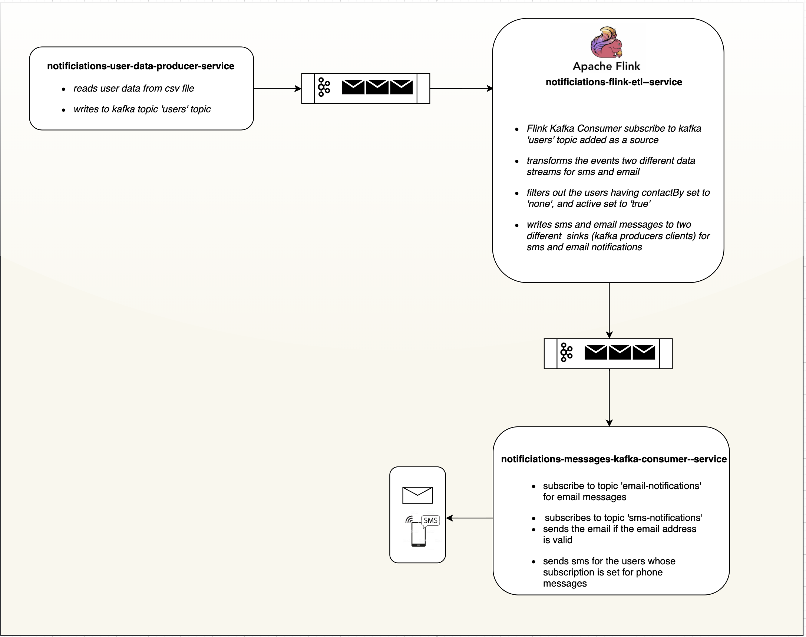
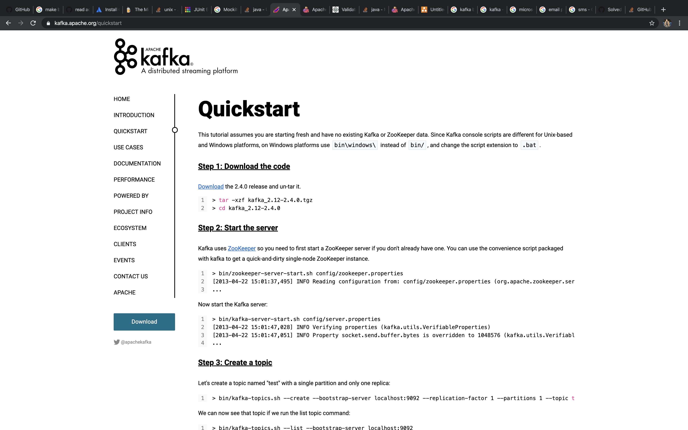
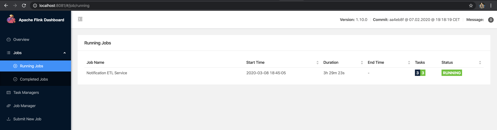
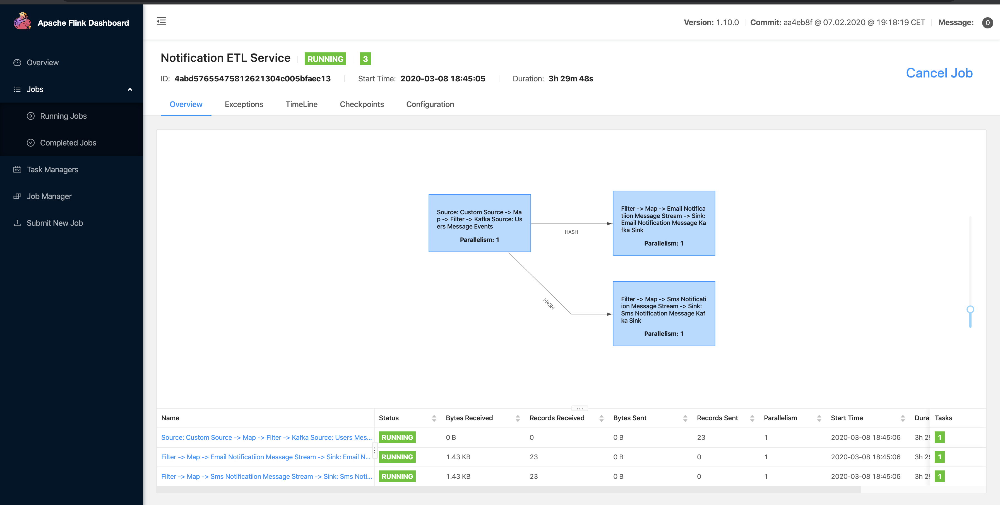

*Implentation*

The solution is a multi-module maven project attempting to illustrate each module behaivng an indepndantly running microservices.

**Modules**:

    - notifications-commons: defines classes and objects shared by all modules
    - notifications-users-data-kafka-producer-service
        - the module is supposed to be run independantly
        - reads csv file and writes to kafka queue
        - writes to 'users' kafka topic
        
    - notifications-flink-etl-service
        - the module is supposed to be submitted as a flink job listening to kafka topic
        - listens to 'users' kafka topic to receive user data.
        - transforms to two data streams and adds them separately in two kafka sinks
            - 'email-notifications': writes the email user data stream to this topic
            - 'sms-notifications': writes to the sms user data stream to this topic
        - filters out the users who are marked not active
        
    - notifications-messages-kafka-consumer
        - supposed to run independantly
        - starts email consumer service and sms consumer in two separate threads
        - subscribes and keeps continuous polling to kafka topics 'email-notifications' and 'sms-notifications'
        - on receiving each event, calls send() method of NotificationService class to both send email or sms
        

**Instructions to setup and run**:

**Install Kafka and Flink**

***Kafka***

- Download: https://kafka.apache.org/quickstart
    
- untar / unzip
    - > tar -xzf kafka_2.12-2.4.0.tgz
    - > cd kafka_2.12-2.4.0
- Start the server
    - Navigate to kafka directory/bin, start zookeeper and kafka-server
        - > bin/zookeeper-server-start.sh config/zookeeper.properties
        - > bin/kafka-server-start.sh config/server.properties
    - make sure you locate config directory above, adust the path as required.
    
***Flink***

- Download: https://downloads.apache.org/flink/flink-1.10.0/flink-1.10.0-bin-scala_2.11.tgz
- untar / unzip
- Start the server
    - Navigate to flink directory/bin, start flink
        - > bin/start-cluster.sh
    - make sure you can view flink web interface after starting, http://localhost:8081    
    
***Setup and Run the project***

- Navigate to project directory and run maven commands to build the jar file
    - > mvn clean package
- The above command will build shadow jar (with all dependences) for each module.
- Now Run and deploy each modules independantly
    - Run flink job: notifications-flink-etl-service
        - navigate to flink bin directory and submit the flink job by running flink command. Please adjust the path of the jar you run on your command
            - > ./flink run -c com.myflinkjob.flink.NotificationsEtlFlinkApplication ~/projects/personal/myflinkjob-coding-challenge/notifications-flink-etl-service/target/notifications-flink-etl-service-1.0-SNAPSHOT.jar 
        - check the flink job manager web interface it should now show the job with the name 'Notification ETL Service'
            
            
            
    - Run Kafka Consumer service: notifications-messages-kafka-consumer-service
        - navigate to project directory and run the following command. Please adjust the path of the jar file as it is relative to your current directory.
            - > java -jar notifications-messages-kafka-consumer-service/target/notifications-messages-kafka-consumer-service-1.0-SNAPSHOT.jar
        - Please keep checking the console log as when we run the producer, flink job runs and result messages are printed as output
        
    - Run Kafka Producer service: notifications-users-data-kafka-producer-service
        - navigate to project directory and run the following command. Please adjust the jar paths accordingly.
           - > java -jar notifications-users-data-kafka-producer-service/target/notifications-users-data-kafka-producer-service-1.0-SNAPSHOT.jar ~/projects/personal/myflinkjob-coding-challenge/notifications-users-data-kafka-producer-service/src/test/resources/test_user_data.txt  "test message" "test phone"
           - Please note that we must provide 3 arguments:
                - first is path of the csv file
                - second is the text content of the email messages which is supposed to be displayed in the  console of consumer service above.
                - third is the text content of sms text supposed to be displayed in the  console of consumer service above.
        - Flink Job and Consumer service is constantly running and listening to kafka queues. While the producer service terminates once it sends the content of csv file to flink job. That means, this is to be run repeatitively whenever you would like to send new csv files.
        
***Expected Behaviour***
- Each time the Producer service is run using 'java jar' command, it should print the email/sms messages for each user.
- All users with 'active' marked as 'false' are flitered out.
- All users with 'contactBy' marked as 'none' are filtered out.
- For Users with 'contactBy' marked as 'all', both email and text messages are expected to be displayed in consumer service console.
- For users with 'contactBy' marked as 'phone' should only have sms messages displayed.
- For users with 'contactBy' marked as 'email' should only have email messges displayed
- For users who have invalid email addresses do not receive email messages, but still will have sms messages displayed.

**Things to consider / Limitations**
- The project is assumed to be running as three different microservices which are independantly dedicated to their own job.
- This help them to be highly available as we could configure the nodes in the cluster, make it scalable as required.
- Flink can be configured for parallelism and backpressure mechanism features to parallelise the streams to make it high performing based on volume of data.
- The parallelism is set to 1 as default for flink for demo purpose
- Kafka uses the default configurations as well, meaning we use only one partition at the moment.
    
**Note**
- I used plain java without using any external libraries like Spring Boot or any other.
- Additioanl dependencies to the pom files:
    - flink and kafka client libraries which were necessary
    - maven shade plugin to make the shadow jar for deployment, for example submitting flink job this was necessary.
    - I had to create pom files for each subprojects as the archticture requried it.